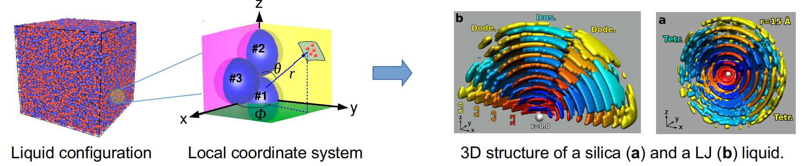
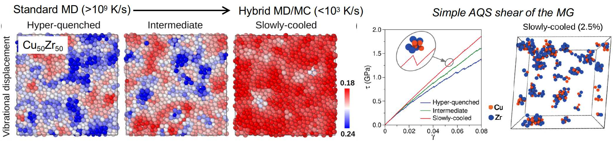
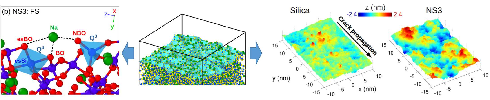

Greetings! I am a researcher at the College of Mathematics and Physics, Chengdu University of Technology (China). I am interested in the emerging properties and non-trivial behaviors in a range of disordered materials, such as oxides glasses, metallic glasses, and granular matter. I use state-of-the-art computational and numerical methods to probe and understand the physics behind the intriguing properties of these systems. 

Jump to: [Resume](#resume); [Research](#research-highlights); [Publications](#publications); [Resources](#resources)

* * *

# Resume
**Dr. Zhen Zhang** 
College of Mathematics and Physics 
Chengdu University of Technology 
Chengdu 610059, China 
Email: zhen.zhang1991@hotmail.com 
[Homepage](https://zhenzhang1991.github.io); [Google Scholar](https://scholar.google.com/citations?user=xlcoVIUAAAAJ&hl=en); 
[ORCID](https://orcid.org/0000-0003-2128-6215)

**Education**
<pre>
2016-2020    Ph.D in Physics, University of Montpellier, France
2013-2016    M.S. in Metallurgical Engineering, Chongqing University, China
2009-2013    B.S. in Metallurgical Engineering, Chongqing University, China
</pre>

**Employment**
<pre>
2023-present  Research Scientist, College of Mathematics and Physics, Chengdu University of Technology, China
2020-2023     Postdoc Researcher, State Key Laboratory for Mechanical Behavior of Materials, Xi’an Jiaotong University, China
2020          Visiting Scholar, School of Physics and Astronomy, Shanghai Jiao Tong University, China
</pre>
* * *

# Research highlights

## 1) Uncover hidden order in disordered systems

Disordered systems such as liquids and glasses have a rich structure that is otherwise hidden if characterized with standard structural measures such as static structure factor. We devised a novel four-point correlation method that allows detecting structural order in liquids on length scales beyond short range. We numerically demonstrated that hard-sphere like systems have a icosahedral orientational order while the prototypical network system silica has a orientational order with tetrahedral symmetry, both of which extending to intermediate and larger distances. Further experimental studies on granular matter and dense colloid liquids have demonstrated that this four-point correlation method indeed allow unraveling the hidden intermediate-range structure and it connections to the particle packing and dynamical heterogeneity in these systems.

Publications for more details:
*  *Zhen Zhang* and Walter Kob. Revealing the three-dimensional structure of liquids using four-point correlation functions. [Proc. Natl. Acad. Sci. U.S.A., 117, 14032 (2020).](https://doi.org/10.1073/pnas.2005638117)
*  Houfei Yuan, *Zhen Zhang*, Walter Kob, and Yujie Wang. Connecting packing efficiency of binary hard sphere systems to their intermediate range structure. [Physical Review Letters, 127, 278001 (2021).](https://journals.aps.org/prl/abstract/10.1103/PhysRevLett.126.066101)
*  Navneet Singh, *Zhen Zhang*, AK Sood, Walter Kob, Rajesh Ganapathy. Intermediate-range order governs dynamics in dense colloidal liquids. [Proc. Natl. Acad. Sci. U.S.A.,120, e2300923120 (2023).](https://www.pnas.org/doi/abs/10.1073/pnas.2300923120)

## 2) Deformation and failure of amorphous solids
The deformation and failure of amorphous materials are much less understood when compared with their crystalline counterparts. This is primarily because of the disordered nature of amorphous structure which makes that even defining structural defects is a very challenging task. 
For metallic glasses, by combing conventional MD method and a highly efficient swap MC algorithm, we have produced computer glass models with a effective cooling rate approaching that typically used in experiments. This hybrid simulation scheme thus allowed successfully bridging the vast timescale gap that has been a long-standing concern for comparing lab glasses with the computer-simulated ones. Further analysis of the slowly-quenched glass has revealed that that shear transformation zones are considerably fewer and smaller than previously believed and cannot be attributed to clear-cut local defects that can be predefined in the glass structure.

For silicate glasses, we have recently investigated their mechanical behavior under tensile loading using large-scale MD simulations. It is found that the non-linear elastic properties of the glasses are originated from the synergy of heterogeneous response of the network structure and the stress-relaxing local coordination environment change of the alkali modifiers. We also found a composition-mediated brittle-to-ductile transition of the nanoscale fracture behavior of the glasses, which can be attributed to change of heterogeneities in various atomic-level properties.

Publications for more details:

*  *Zhen Zhang*, Jun Ding, and Evan Ma. Shear transformations in metallic glasses without excessive and predefinable defects. [Proc. Natl. Acad. Sci. U.S.A., 119, e2213941119 (2022).](https://doi.org/10.1073/pnas.2213941119)
*  Zhen Zhang, Simona Ispas, and Walter Kob. Origin of the non-linear elastic behavior of silicate glasses. [Acta Materialia, 231, 117855 (2022).](https://arxiv.org/pdf/2111.09549.pdf)
*  *Zhen Zhang*, Simona Ispas, and Walter Kob. Fracture of silicate glasses: Microcavities and correlations between atomic-level properties. [Physical Review Materials, 6, 085601 (2022).](https://doi.org/10.1103/PhysRevMaterials.6.085601)

## 3) Monolayer surface properties of silicate glasses

Surface properties lie at the core of many applications of silicate glasses. In our recent work we combine large-scale classical MD simulations with first-principles calculations to investigate the characteristics of silicate glass surfaces on the level of single atomic layer. Our MD simulations revealed the presence of structural defects that are potential reactive sites on the surfaces. Their vibrational and electronic signatures were further identified jointly from the classical and ab initio simulations. Moreover, the large-scale simulations allowed to study the topographical features of the melt-quenched surface and the fracture surface of the glasses. It is revealed that the melt-quenched surface is considerably smaller than the fracture surface. The Fracture is found to exhibit a logarithmic scaling of the surface height fluctuation, indicating that it is not fractal object on the nanometer scale.

Publications for more details:
*  *Zhen Zhang*, Simona Ispas, and Walter Kob. Roughness and scaling properties of oxide glass surfaces at the nanoscale. [Physical Review Letters, 126, 066101 (2021).](https://journals.aps.org/prl/abstract/10.1103/PhysRevLett.126.066101)
*  *Zhen Zhang*, Walter Kob, and Simona Ispas. First-principles study of the surface of silica and sodium silicate glasses. [Physical Review B, 103, 184201 (2021).](https://journals.aps.org/prb/abstract/10.1103/PhysRevB.103.184201)
*  *Zhen Zhang*, Simona Ispas, and Walter Kob. Structure and vibrational properties of sodium silicate glass surfaces. [The Journal of Chemical Physics, 153, 124503 (2020).](https://arxiv.org/pdf/2006.14791.pdf)

## 4) Irradiation of structurally and chemically complex materials

High- and medium-entropy alloys (H/MEAs) are an emerging type of materials with great potentials in both structural and nuclear applications. Recent studies have shown that a salient feature that sets these alloys apart from pure metals and dilute solid solutions is their chemical complexities in the form of local chemical order (LCO). Combining atomistic simulations with in situ ion irradiation experiments of a representative CrCoNi MEA, we demonstrated that increased LCO significantly enhances its resistance to irradiation damage by narrowing the mobility ratio of irradiation-induced interstitials and
vacancies that can facilitate their recombination.  This finding opens an avenue towards the design of structurally and chemically complex materials with superior irradiation tolerance. 

Publications for more details:
*  *Zhen Zhang*, Zhengxiong Su, Bozhao Zhang, Qin Yu, Jun Ding, Tan Shi, Chenyang Lu, Robert O. Ritchie, Evan Ma. Effect of local chemical order on the irradiation-induced defect evolution in CrCoNi medium-entropy alloy. [Proc. Natl. Acad. Sci. U.S.A., 120, e2218673120 (2023).](https://www.pnas.org/doi/abs/10.1073/pnas.2218673120)

* * *

# Publications

1. *Zhen Zhang*, Simona Ispas, Walter Kob. Surface properties of alkali silicate glasses: Influence of the modifiers. [The Journal of Chemical Physics, in press (2013).](https://arxiv.org/pdf/2304.10781.pdf)
1. Linfeng Ding, Ranran Lu, Lianjun Wang, Qiuju Zheng, John C. Mauro, *Zhen Zhang*. Nanoindentation-induced evolution of atomic-level properties in silicate glass: Insights from molecular dynamics simulations. [Journal of the American Ceramic Society, in press (2013).](https://arxiv.org/pdf/2305.04202.pdf)
1. Navneet Singh, *Zhen Zhang*, AK Sood, Walter Kob, Rajesh Ganapathy. Intermediate-range order governs dynamics in dense colloidal liquids. [Proc. Natl. Acad. Sci. U.S.A.,120, e2300923120 (2023).](https://www.pnas.org/doi/abs/10.1073/pnas.2300923120)
0. *Zhen Zhang*, Zhengxiong Su, Bozhao Zhang, Qin Yu, Jun Ding, Tan Shi, Chenyang Lu, Robert O. Ritchie, Evan Ma. Effect of local chemical order on the irradiation-induced defect evolution in CrCoNi medium-entropy alloy. [Proc. Natl. Acad. Sci. U.S.A., 120, e2218673120 (2023).](https://www.pnas.org/doi/abs/10.1073/pnas.2218673120)
0. Zhi-Hao Wang, Xuan-Yan Chen, *Zhen Zhang*, Xie Zhang, Su-Huai Wei. Profiling the off-center atomic displacements in CuCl at finite temperatures with a deep-learning potential. [Physical Review Materials, 7, 034601 (2023)](https://journals.aps.org/prmaterials/abstract/10.1103/PhysRevMaterials.7.034601)
0. Chang Liu, *Zhen Zhang*, Jun Ding, and Evan Ma. On the reliability of using reverse Monte Carlo simulations to construct the atomic structure model of metallic
glasses. [Scripta Materialia, 225, 115159 (2023).](https://www.sciencedirect.com/science/article/abs/pii/S1359646222006546?via%3Dihub)
0. Kaihui Xun, Bozhao Zhang, Qi Wang, *Zhen Zhang*, Jun Ding, En Ma. Local chemical inhomogeneities in TiZrNb-based refractory high-entropy alloys. [Journal of Materials Science & Technology, 135, 221-230 (2023).](https://www.sciencedirect.com/science/article/abs/pii/S1005030222006090)
0. *Zhen Zhang*, Jun Ding, and Evan Ma. Shear transformations in metallic glasses without excessive and predefinable defects. [Proc. Natl. Acad. Sci. U.S.A., 119, e2213941119 (2022).](https://doi.org/10.1073/pnas.2213941119)
0. *Zhen Zhang*, Simona Ispas, and Walter Kob. Fracture of silicate glasses: Microcavities and correlations between atomic-level properties. [Physical Review Materials, 6, 085601 (2022).](https://doi.org/10.1103/PhysRevMaterials.6.085601)
0. *Zhen Zhang*, Simona Ispas, and Walter Kob. Origin of the non-linear elastic behavior of silicate glasses. [Acta Materialia, 231, 117855 (2022).](https://arxiv.org/pdf/2111.09549.pdf)
0. Houfei Yuan, *Zhen Zhang*, Walter Kob, and Yujie Wang. Connecting packing efficiency of binary hard sphere systems to their intermediate range structure. [Physical Review Letters, 127, 278001 (2021).](https://journals.aps.org/prl/abstract/10.1103/PhysRevLett.126.066101)
0. *Zhen Zhang*, Simona Ispas, and Walter Kob. Roughness and scaling properties of oxide glass surfaces at the nanoscale. [Physical Review Letters, 126, 066101 (2021).](https://journals.aps.org/prl/abstract/10.1103/PhysRevLett.126.066101)
0. *Zhen Zhang*, Walter Kob, and Simona Ispas. First-principles study of the surface of silica and sodium silicate glasses. [Physical Review B, 103, 184201 (2021).](https://journals.aps.org/prb/abstract/10.1103/PhysRevB.103.184201)
0. *Zhen Zhang* and Walter Kob. Revealing the three-dimensional structure of liquids using four-point correlation functions. [Proc. Natl. Acad. Sci. U.S.A., 117, 14032 (2020).](https://doi.org/10.1073/pnas.2005638117)
0. *Zhen Zhang*, Simona Ispas, and Walter Kob. Structure and vibrational properties of sodium silicate glass surfaces. [The Journal of Chemical Physics, 153, 124503 (2020).](https://arxiv.org/pdf/2006.14791.pdf)
0. *Zhen Zhang*, Simona Ispas, and Walter Kob. The critical role of the interaction potential and simulation protocol for the structural and mechanical properties of sodosilicate glasses. [Journal of Non-Crystalline Solids, 532, 119895 (2020).](https://doi.org/10.1016/j.jnoncrysol.2020.119895)
0. *Zhen Zhang*, Bing Xie, Wang Zhou, Jiang Diao, and Hongyi Li. Structural characterization of FeO-SiO2-V2O3 slags using molecular dynamics simulations and FTIR
spectroscopy. [ISIJ International, 56, 828 (2016).](https://doi.org/10.2355/isijinternational.ISIJINT-2015-600)
{: reversed="reversed"}
* * *

# Resources
## Codes and scripts
[Four-point correlation structural analysis](https://github.com/zhenzhang1991/three-dimensional-structure)
