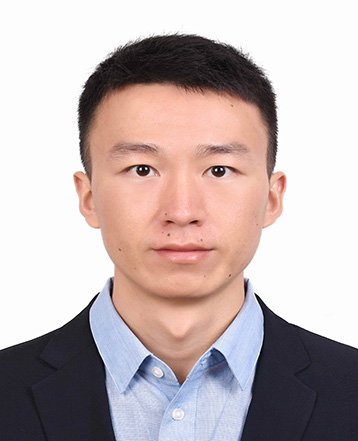

<!-- ===== HEADER / INTRO ===== -->

Greetings! I am a Research Scientist in the **Department of Physics, Chengdu University of Technology**, China.  
My research focuses on the **structure and properties of disordered systems**—liquids, glasses, complex alloys, and granular matter—through advanced computational and numerical methods.

 

---

### **Quick Navigation**
[Resume](#resume) • [Research](#research-highlights) • [Publications](#publications) • [Resources](#resources) • [People](#group-members)

---

# **Resume**

**Dr. Zhen Zhang**  
Department of Physics, Chengdu University of Technology,  
Chengdu 610059, China  
**Email:** zhen.zhang@cdut.edu.cn  

**Links:**  
[Homepage](https://zhenzhang1991.github.io) · 
[Google Scholar](https://scholar.google.com/citations?user=xlcoVIUAAAAJ&hl=en) ·  
[ORCID](https://orcid.org/0000-0003-2128-6215) · 
[Web of Science](https://www.webofscience.com/wos/author/record/IWE-2491-2023) ·  
[CV (PDF)](docs/ZhenZhangCV-Sep2023.pdf)

---

## **Education**

**2016–2020** — Ph.D. in Physics, *University of Montpellier*, France  
&nbsp;&nbsp;&nbsp;&nbsp;Advisors: Prof. Walter Kob & Dr. Simona Ispas  
&nbsp;&nbsp;&nbsp;&nbsp;Thesis: *Fracture, surface, and structure of silicate glasses*  
**2013–2016** — M.E., Metallurgical Engineering, *Chongqing University*  
**2009–2013** — B.E., Metallurgical Engineering, *Chongqing University*

---

## **Employment**

**2023–present** — Research Scientist, Chengdu University of Technology  
**2024–2025** — Visiting Research Fellow, University of Tokyo (Prof. Hajime Tanaka)  
**2020–2023** — Postdoctoral Researcher, Xi’an Jiaotong University  
**2020** — Visiting Researcher, Shanghai Jiao Tong University  

---

# **Research Highlights**

Each section below summarizes one major theme of my current research.  
Click the corresponding publications for more details.

---

## **1) Hidden Order in Disordered Systems**

Standard two-point structural measures often miss medium-range order.  
We developed a **four-point correlation method** that reveals hidden orientational order in liquids, glasses, colloids, and granular matter.

**Key publications:**  
- *Zhen Zhang* & W. Kob, **PNAS 2020**  
- H. Yuan, *Z. Zhang* et al., **PRL 2021**  
- N. Singh, *Z. Zhang* et al., **PNAS 2023**  
- *Z. Zhang* & W. Kob, **PRB 2024**  
- *Z. Zhang*, Z. Xie & W. Kob, **PNAS 2025**

---

## **2) Deformation & Failure of Amorphous Solids**

We explore how metallic and oxide glasses deform, focusing on  
**shear transformation zones (STZs)**, cooling-rate effects, and fracture behavior.

**Key publications:**  
- *Z. Zhang*, J. Ding & E. Ma, **PNAS 2022**  
- *Z. Zhang*, S. Ispas & W. Kob, **Acta Mater. 2022**  
- *Z. Zhang*, S. Ispas & W. Kob, **PRM 2022**  
- J. Yu, *Z. Zhang* et al., **PNAS 2025**

---

## **3) Surface Properties of Oxide Glasses**

Using large-scale MD and DFT, we study  
**atomic-scale surface structure, roughness, and vibrational/electronic signatures**.

**Key publications:**  
- *Z. Zhang*, S. Ispas & W. Kob, **JCP 2023**  
- *Z. Zhang*, S. Ispas & W. Kob, **PRL 2021**  
- *Z. Zhang*, W. Kob & S. Ispas, **PRB 2021**  
- *Z. Zhang*, S. Ispas & W. Kob, **JCP 2020**

---

## **4) Irradiation Response of Multi-Principal-Element Alloys**

Local chemical order (LCO) governs defect dynamics in H/MEAs.  
We combine atomistic simulations with in-situ irradiation experiments.

**Key publications:**  
- *Z. Zhang* et al., **PNAS 2023**  
- B. Zhang, *Z. Zhang* et al., **PNAS 2024**

---

