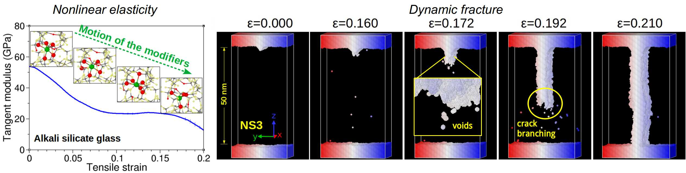

Greetings. I am a Research Scientist at the Department of Physics, Chengdu University of Technology (China). My research focuses on the structure and properties of disordered systems, such as liquids, glasses, complex alloys, and granular materials. I use state-of-the-art computational and numerical methods to probe and understand the physics behind the intriguing behavior of these systems. 

Jump to: [Resume](#resume); [Research](#research-highlights); [Publications](#publications); [Resources](#resources); [People](#group-members)

* * *

# Resume
**Dr. Zhen Zhang** 
Department of Physics 
Chengdu University of Technology 
Chengdu 610059, China 
Email: zhen.zhang@cdut.edu.cn 
[Homepage](https://zhenzhang1991.github.io); [Google Scholar](https://scholar.google.com/citations?user=xlcoVIUAAAAJ&hl=en); 
[ORCID](https://orcid.org/0000-0003-2128-6215); [Web of Science](https://www.webofscience.com/wos/author/record/IWE-2491-2023); [CV](docs/ZhenZhangCV-Sep2023.pdf)

**Education**

2016-2020   Ph.D in Physics, University of Montpellier, France (with Prof. [Walter Kob](https://coulomb.umontpellier.fr/perso/walter.kob/) and Dr. [Simona Ispas](https://www.researchgate.net/profile/Simona-Ispas))  
2013-2016   M.E. in Metallurgical Engineering, Chongqing University, China  
2009-2013   B.E. in Metallurgical Engineering, Chongqing University, China

**Employment**

2023-present  Research Scientist, Department of Physics, Chengdu University of Technology, China  
2020-2023   Postdoctoral Researcher, State Key Laboratory for Mechanical Behavior of Materials, Xi’an   
       Jiaotong University, China (with Prof. [Evan Ma](https://scholar.google.com/citations?user=wvnI5qIAAAAJ&hl=en) and Prof. [Jun Ding](http://gr.xjtu.edu.cn/en/web/dingsn/home))  
2020     Visiting Scholar, School of Physics and Astronomy, Shanghai Jiao Tong University, China  
       (with Prof. [Yujie Wang](https://xray.sjtu.edu.cn/a/en/))

* * *

# Research highlights

## 1) Uncover hidden order in disordered systems

Disordered systems such as liquids and glasses have a rich structure that is usually hidden if characterized with standard structural measures such as the static structure factor. We recently devised a novel four-point correlation method that allows detecting structural order in liquids on length scales well beyond nearest neighbors. We numerically demonstrated that hard-sphere-like systems have an icosahedral orientational order while the prototypical network-forming system silica has an orientational order with tetrahedral symmetry, both of which extending to intermediate and larger distances. Further experimental studies on granular matter and dense colloid liquids demonstrated that this four-point correlation method indeed allows unraveling the hidden intermediate-range order and it connections to particle packing efficiency and dynamical heterogeneity in these systems.

Publications for more details:
*  *Zhen Zhang* and Walter Kob. Revealing the three-dimensional structure of liquids using four-point correlation functions. [Proc. Natl. Acad. Sci. U.S.A., 117, 14032 (2020).](docs/2020-zhang-pnas.pdf)
*  Houfei Yuan, *Zhen Zhang*, Walter Kob, and Yujie Wang. Connecting packing efficiency of binary hard sphere systems to their intermediate range structure. [Phys. Rev. Lett., 127, 278001 (2021).](docs/2021-yuan-prl.pdf)
*  Navneet Singh, *Zhen Zhang*, AK Sood, Walter Kob, and Rajesh Ganapathy. Intermediate-range order governs dynamics in dense colloidal liquids. [Proc. Natl. Acad. Sci. U.S.A.,120, e2300923120 (2023).](docs/2023-singh-pnas.pdf)

## 2) Deformation and failure of amorphous solids
The deformation and failure of amorphous materials are much less understood when compared with their crystalline counterparts. This is primarily because of the disordered nature of the amorphous structure which makes that even defining structural defects becomes a very challenging task. In our recent work, by combing the conventional MD method with a highly efficient swap MC algorithm, we have successfully produced computer metallic glass models with an effective cooling rate approaching that typically used in experiments. This hybrid simulation scheme thus allowed us to bridge the vast timescale gap that has been a long-standing concern for comparing lab glasses with the computer-simulated ones. Further analysis of the slowly-quenched glass has revealed that shear transformation zones (STZs) are considerably fewer and smaller than previously believed and cannot be attributed to clear-cut local defects that can be predefined in the glass structure.

For silicate glasses, we have recently investigated their mechanical behavior under tensile loading using large-scale MD simulations. It is found that the non-linear elastic properties of the glasses originate from the combined effect of heterogeneous response of the network structure and the stress-relaxing local coordination environment variations of the alkali modifiers. We also found a composition-mediated brittle-to-ductile transition of the nanoscale fracture behavior of the glasses, which can be related to the change of heterogeneities in various atomic-level properties.

Publications for more details:

*  *Zhen Zhang*, Jun Ding, and Evan Ma. Shear transformations in metallic glasses without excessive and predefinable defects. [Proc. Natl. Acad. Sci. U.S.A., 119, e2213941119 (2022).](docs/2022-zhang-pnas.pdf)
*  *Zhen Zhang*, Simona Ispas, and Walter Kob. Origin of the non-linear elastic behavior of silicate glasses. [Acta Mater., 231, 117855 (2022).](docs/2022-zhang-acta.pdf)
*  *Zhen Zhang*, Simona Ispas, and Walter Kob. Fracture of silicate glasses: Microcavities and correlations between atomic-level properties. [Phy. Rev. Mater., 6, 085601 (2022).](docs/2022-zhang-prm.pdf)

## 3) Monolayer surface properties of oxide glasses

Surface properties lie at the core of many applications of silicate glasses. In our recent work we have combined large-scale classical MD simulations with (DFT-based) first-principles calculations to investigate the characteristics of silicate glass surfaces on the level of single atomic layer. Our MD simulations revealed the presence of structural defects that are potential reactive sites on the surfaces; their vibrational and electronic signatures were further identified jointly from the classical and ab initio simulations. Moreover, the large-scale simulations allowed us to study the topographical features of the melt-quenched surface and the fracture surface of the glasses. It is revealed that the roughness of the melt-quenched surface is considerably smaller than that of the fracture surface. In contrast to experimental findings, we find that the fracture surface exhibits a logarithmic scaling of the surface height fluctuation, indicating that it is not fractal object on the nanometer scale.

Publications for more details:
*  *Zhen Zhang*, Simona Ispas, and Walter Kob. Surface properties of alkali silicate glasses: Influence of the modifiers. [J. Chem. Phys., 158, 244504 (2023).](docs/2023-zhang-jcp.pdf)
*  *Zhen Zhang*, Simona Ispas, and Walter Kob. Roughness and scaling properties of oxide glass surfaces at the nanoscale. [Phys. Rev. Lett., 126, 066101 (2021).](docs/2021-zhang-prl.pdf)
*  *Zhen Zhang*, Walter Kob, and Simona Ispas. First-principles study of the surface of silica and sodium silicate glasses. [Phys. Rev.B, 103, 184201 (2021).](docs/2021-zhang-prb.pdf)
*  *Zhen Zhang*, Simona Ispas, and Walter Kob. Structure and vibrational properties of sodium silicate glass surfaces. [J. Chem. Phys., 153, 124503 (2020).](docs/2020-zhang-jcp.pdf)

## 4) Irradiation response of multi-principal element alloys

High- and medium-entropy alloys (H/MEAs) are an emerging type of materials with great potentials in both structural and nuclear applications. Recent studies have shown that a salient feature that sets these alloys apart from pure metals and dilute solid solutions is their chemical complexities in the form of local chemical order (LCO). Combining atomistic simulations with in situ ion irradiation experiments, we demonstrated for a representative CrCoNi MEA that increased LCO significantly enhances its resistance to irradiation damage by narrowing the mobility ratio of irradiation-induced interstitials and
vacancies that can facilitate their recombination.  This finding opens an avenue towards the design of structurally and chemically complex materials with superior radiation tolerance. 

Publication for more details:
*  *Zhen Zhang*, Zhengxiong Su, Bozhao Zhang, Qin Yu, Jun Ding, Tan Shi, Chenyang Lu, Robert O. Ritchie, and Evan Ma. Effect of local chemical order on the irradiation-induced defect evolution in CrCoNi medium-entropy alloy. [Proc. Natl. Acad. Sci. U.S.A., 120, e2218673120 (2023).](docs/2023-zhang-pnas.pdf)
*  Bozhao Zhang, *Zhen Zhang*, Kaihui Xun, Mark Asta, Jun Ding, and Evan Ma. Minimizing the diffusivity difference between vacancies and interstitials in multi-­principal element alloys. [Proc. Natl. Acad. Sci. U.S.A., 121, e2314248121 (2024).](docs/2024-zhangb-pnas.pdf)

* * *

# Publications
0. Minimizing the diffusivity difference between vacancies and interstitials in multi-­principal element alloys  
   Bozhao Zhang, *Zhen Zhang*, Kaihui Xun, Mark Asta, Jun Ding, and Evan Ma  
   [Proc. Natl. Acad. Sci. U.S.A., 121, e2314248121 (2024)](docs/2024-zhangb-pnas.pdf) 
0. Nanoindentation-induced evolution of atomic-level properties in silicate glass: Insights from molecular dynamics simulations  
   Linfeng Ding, Ranran Lu, Lianjun Wang, Qiuju Zheng, John C. Mauro, and *Zhen Zhang*  
   [J. Am. Ceram. Soc., 107,1448 (2024)](docs/2023-lu-jace.pdf) [Editor's Choice]
0. Influence of friction on the packing efficiency and short-to-intermediate range structure of hard-sphere systems  
   Jiajun Tang, Xiaohui Wen, *Zhen Zhang*, Deyin Wang, Xinbiao Huang, and Yujie Wang  
   [J. Chem. Phys., 159, 194901 (2023)](docs/2023-tang-jcp.pdf)
0. Surface properties of alkali silicate glasses: Influence of the modifiers  
   *Zhen Zhang*, Simona Ispas, and Walter Kob  
   [J. Chem. Phys., 158, 244504 (2023)](docs/2023-zhang-jcp.pdf)
0. Intermediate-range order governs dynamics in dense colloidal liquids  
   Navneet Singh, *Zhen Zhang*, AK Sood, Walter Kob, and Rajesh Ganapathy  
   [Proc. Natl. Acad. Sci. U.S.A.,120, e2300923120 (2023)](docs/2023-singh-pnas.pdf) 
0. Effect of local chemical order on the irradiation-induced defect evolution in CrCoNi medium-entropy alloy 
   *Zhen Zhang*, Zhengxiong Su, Bozhao Zhang, Qin Yu, Jun Ding, Tan Shi, Chenyang Lu, Robert O. Ritchie, and Evan Ma  
   [Proc. Natl. Acad. Sci. U.S.A., 120, e2218673120 (2023)](docs/2023-zhang-pnas.pdf) [News: [XJTU](http://news.xjtu.edu.cn/info/1033/193974.htm)]
0. Profiling the off-center atomic displacements in CuCl at finite temperatures with a deep-learning potential  
   Zhi-Hao Wang, Xuan-Yan Chen, *Zhen Zhang*, Xie Zhang, and Su-Huai Wei  
   [Phys. Rev. Mater., 7, 034601 (2023)](docs/2023-wang-prm.pdf)
0. On the reliability of using reverse Monte Carlo simulations to construct the atomic structure model of metallic glasses 
   Chang Liu, *Zhen Zhang*, Jun Ding, and Evan Ma  
   [Scr. Mater., 225, 115159 (2023)](docs/2022-liu-scripta.pdf)
0. Local chemical inhomogeneities in TiZrNb-based refractory high-entropy alloys  
   Kaihui Xun, Bozhao Zhang, Qi Wang, *Zhen Zhang*, Jun Ding, and En Ma  
   [J. Mater. Sci. Technol., 135, 221-230 (2023)](docs/2023-xun-jmst.pdf)
0. Shear transformations in metallic glasses without excessive and predefinable defects  
   *Zhen Zhang*, Jun Ding, and Evan Ma  
   [Proc. Natl. Acad. Sci. U.S.A., 119, e2213941119 (2022)](docs/2022-zhang-pnas.pdf) [News: [XJTU](http://news.xjtu.edu.cn/info/1219/189693.htm)]
0. Fracture of silicate glasses: Microcavities and correlations between atomic-level properties  
   *Zhen Zhang*, Simona Ispas, and Walter Kob
   [Phys. Rev. Mater., 6, 085601 (2022)](docs/2022-zhang-prm.pdf)
0. Origin of the non-linear elastic behavior of silicate glasses  
   *Zhen Zhang*, Simona Ispas, and Walter Kob  
   [Acta Mater., 231, 117855 (2022)](docs/2022-zhang-acta.pdf) [News: [MSE](https://mp.weixin.qq.com/s/kmkXOZsHK5hV2Nso0SdtVA)]
0. Connecting packing efficiency of binary hard sphere systems to their intermediate range structure  
   Houfei Yuan, *Zhen Zhang*, Walter Kob, and Yujie Wang  
   [Phys. Rev. Lett., 127, 278001 (2021)](docs/2021-yuan-prl.pdf)
0. Roughness and scaling properties of oxide glass surfaces at the nanoscale  
   *Zhen Zhang*, Simona Ispas, and Walter Kob  
   [Phys. Rev. Lett., 126, 066101 (2021)](docs/2021-zhang-prl.pdf)
0. First-principles study of the surface of silica and sodium silicate glasses  
   *Zhen Zhang*, Walter Kob, and Simona Ispas  
   [Phys. Rev. B, 103, 184201 (2021)](docs/2021-zhang-prb.pdf)
0. Revealing the three-dimensional structure of liquids using four-point correlation functions  
   *Zhen Zhang* and Walter Kob  
   [Proc. Natl. Acad. Sci. U.S.A., 117, 14032 (2020)](docs/2020-zhang-pnas.pdf)
0. Structure and vibrational properties of sodium silicate glass surfaces  
   *Zhen Zhang*, Simona Ispas, and Walter Kob  
   [J. Chem. Phys., 153, 124503 (2020)](docs/2020-zhang-jcp.pdf)
0. The critical role of the interaction potential and simulation protocol for the structural and mechanical properties of sodosilicate glasses  
   *Zhen Zhang*, Simona Ispas, and Walter Kob  
   [J. Non-Cryst. Solids, 532, 119895 (2020)](docs/2020-zhang-jncs.pdf)
0. Structural characterization of FeO-SiO2-V2O3 slags using molecular dynamics simulations and FTIR spectroscopy  
   *Zhen Zhang*, Bing Xie, Wang Zhou, Jiang Diao, and Hongyi Li  
   [ISIJ Int., 56, 828 (2016)](docs/2016-zhang-isij.pdf)
{: reversed="reversed"}
* * *

# Group Members

| Name | Role | Duration | Research direction |
| ---- | ---- | -------- | -------------- |
| Nanqin Xiao | Graduate student | 09/2022-now | Frictional granular matter |
| Zhengcheng Xie | Graduate student | 09/2023-now | Oxide glasses under extreme deformation |
| Xin Zhang | Undergraduate student | 11/2023-now |  |

* * *

# Resources
## Codes and scripts
[Four-point correlation structural analysis](https://github.com/zhenzhang1991/three-dimensional-structure)

